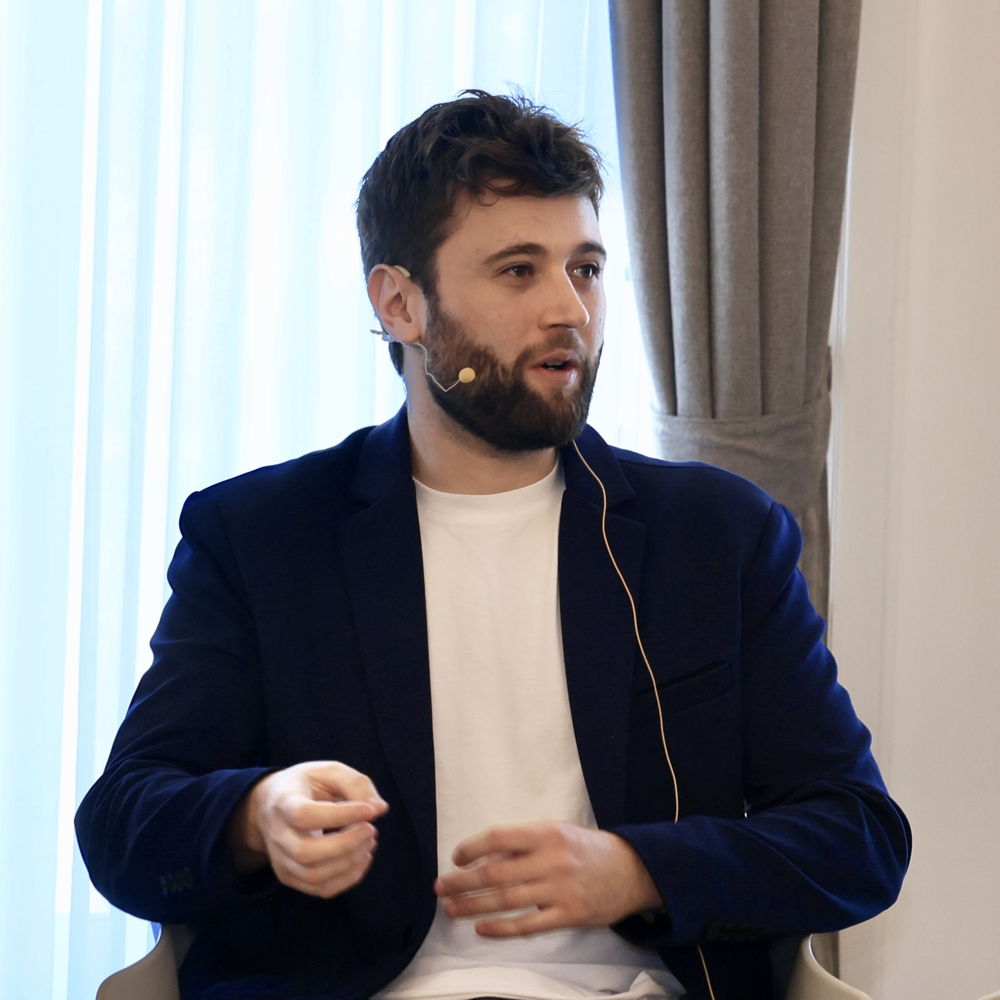

<section class="hero">
  
LLM Researcher · <a href="https://multiversecomputing.com">Multiverse Computing</a> | Donostia–San Sebastián · Spain | <a href="mailto:igarciaf896@gmail.com">igarciaf896@gmail.com</a>

  

    

      PhD in Natural Language Processing (NLP) by <a href="https://www.ehu.eus/en/en-home">University of the Basque Country UPV/EHU</a>, <a href="http://www.ixa.eus/?language=en">IXA Group</a>, and <a href="http://www.hitz.eus/">HiTZ Basque Center for Language Technologies</a>. I specialize in training, compressing, and optimizing large-scale foundation models for both language and vision.
        
      I have contributed to the development of several state-of-the-art models: <a href="https://huggingface.co/MultiverseComputingCAI/Hypernova-60B-2602">Hypernova-60B</a>, a compressed LLM optimized for agentic and tool-use workflows at <a href="https://multiversecomputing.com">Multiverse Computing</a>; <a href="https://www.krea.ai/blog/flux-krea-open-source-release">FLUX.1 Krea</a>, a 22B diffusion image model trained in collaboration with Black Forest Labs; <a href="https://arxiv.org/abs/2506.07597">Latxa</a>, a Basque instruction-tuned LLM with performance comparable to GPT-4o and Claude Sonnet; <a href="https://hitz-zentroa.github.io/GoLLIE/">GoLLIE</a>, a 34B-parameter model achieving state-of-the-art zero-shot Information Extraction; and <a href="https://huggingface.co/HiTZ/Medical-mT5-xl">MedMT5</a>, the first open-source multilingual text-to-text model for the medical domain.
        
      Strong experience in performance optimization and HPC across academic and industry environments. At HiTZ, I trained Latxa on the <a href="https://leonardo-supercomputer.cineca.eu/hpc-system/">Leonardo Supercomputer</a> using up to 512 GPUs across 128 nodes. At <a href="https://www.krea.ai">Krea</a>, I worked on optimizing fine-tuning pipelines for video and image diffusion models using distributed training techniques such as FSDP2 on Krea's internal GPU cluster. At <a href="https://multiversecomputing.com">Multiverse Computing</a>, I optimize inference and fine-tuning pipelines on the company's internal GPU cluster, achieving 3x faster logit precomputation and 5x faster KL-divergence training.
        
   Currently an LLM Researcher at <a href="https://multiversecomputing.com">Multiverse Computing</a>.
        
   Exponential Fellow 2025 <a href="https://www.goexponential.org">https://www.goexponential.org/directory/fellows/iker-garcia-ferrero</a>
        
      In my free time, I develop <a href="https://veridika.ai">veridika.ai</a>, an AI agent framework for real-time fact-checking.
    

  

  

    
    

      
      
      
      
    

    

      
      
      
      
      
      
    

  

</section>

