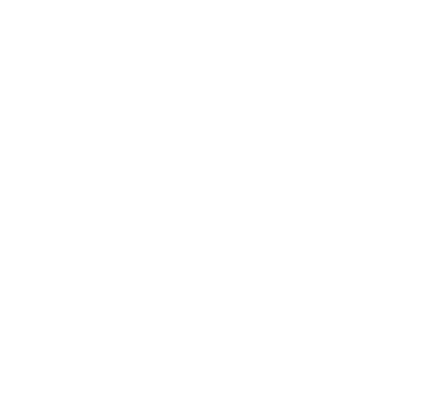
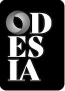
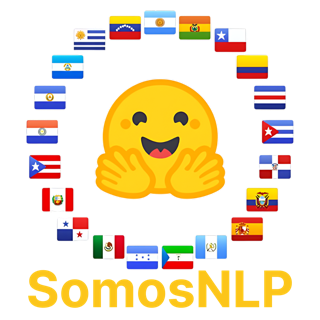
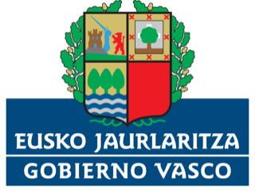
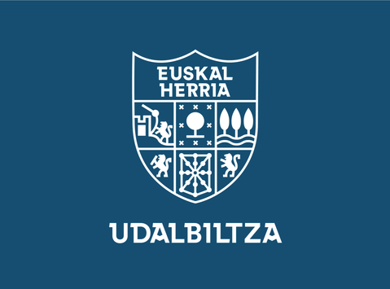

# Experience

  

    
    

      <h3 class="card-title">Senior LLM Researcher</h3>
      
Multiverse Computing

      
Aug. 2026 – present

      
Donostia - San Sebastián · Spain

      <ul>
        <li>Training large language models, from data acquisition and pipeline development to pre-training, fine-tuning, reinforcement learning, and optimization at scale.</li>
      </ul>
    

  

  

    
    

      <h3 class="card-title">LLM Researcher</h3>
      
Multiverse Computing

      
Aug. 2025 – Jul. 2026

      
Donostia - San Sebastián · Spain

      <ul>
        <li>Developing compressed LLMs that make AI systems faster, cheaper, and more energy-efficient, including <a href="https://huggingface.co/MultiverseComputingCAI/Hypernova-60B-2602">Hypernova-60B</a>, a 60B-parameter model optimized for agentic workflows and tool use.</li>
        <li>Developed a steering-vector method for editing LLM knowledge and behavior, including adding or removing censorship around sensitive topics while preserving model performance.</li>
        <li>Optimized internal inference and fine-tuning codebases, achieving 3x faster logit precomputation and 5x faster KL-divergence training.</li>
        <li>Built large-scale synthetic data generation pipelines for LLM training and evaluation.</li>
      </ul>
    

  

  

    
    

      <h3 class="card-title">Machine Learning Researcher</h3>
      
Krea.ai

      
Jan. 2025 – Jul. 2025

      
San Francisco · US

      <ul>
        <li>Contributed to the development of <a href="https://www.krea.ai/blog/flux-krea-open-source-release">FLUX.1 Krea</a>, a 22B diffusion-based image model trained in collaboration with Black Forest Labs.</li>
        <li>Developed a personalized image recommendation engine using user interaction data and deep learning techniques.</li>
        <li>Designed and trained SigLIP-style embedding models for artistic style-based image retrieval.</li>
        <li>Improved fine-tuning codebases for video (Wan 2.1) and image (Flux) models, focusing on training performance and distributed training techniques such as FSDP2.</li>
        <li>Implemented and deployed generative services for 3D models and textures, powering features used by thousands of users on the Krea platform.</li>
      </ul>
    

  

  

    
    

      <h3 class="card-title">Visiting PhD Student</h3>
      
University of Pennsylvania

      
Oct. 2022 – Jan. 2023

      
Philadelphia · US

      <ul>
        <li><strong>Advisor:</strong> Dan Roth</li>
      </ul>
    

  

  

    
    

      <h3 class="card-title">PhD in Natural Language Processing</h3>
      
HiTZ Zentroa

      
Jan. 2020 – Feb. 2025

      
Donostia - San Sebastián · Spain

      <ul>
        <li><strong>Title:</strong> Acquisition and exploitation of Cross-Lingual knowledge</li>
        <li><strong>Advisors:</strong> German Rigau, Rodrigo Agerri</li>
      </ul>
    

  

  

    
    

      <h3 class="card-title">Applied Scientist Intern</h3>
      
Amazon

      
Nov. 2019 – Feb. 2020

      
Barcelona · Spain

    

  

  

    
    

      <h3 class="card-title">Master's in Natural Language Processing</h3>
      
University of the Basque Country UPV/EHU

      
2018 – 2019

      
Donostia - San Sebastián · Spain

    

  

  

    
    

      <h3 class="card-title">Bachelor in Computer Science</h3>
      
University of the Basque Country UPV/EHU

      
2014 – 2018

      
Donostia - San Sebastián · Spain

    

  

# Grants and Awards

  

    
    

      <h3 class="card-title">Exponential Fellow</h3>
      
The Exponential Fellowship

      
2025

      
The Exponential Fellowship: A fellowship program that aims to find brightest builders in Spain to send on a life-changing experience to the US.

      
<a href="https://www.goexponential.org">https://www.goexponential.org/directory/fellows/iker-garcia-ferrero</a>

    

  

  

    
    

      <h3 class="card-title">Winner of the ODESIA Challenge @ SEPLN 2024</h3>
      
UNED

      
Feb. 2025

      
Winner of the ODESIA Challenge. The aim of the competition is to promote the development and evaluation of language models in Spanish.

      
<a href="https://leaderboard.odesia.uned.es/leaderboard/challenge">Competition Leaderboard</a>

    

  

  

    
    

      <h3 class="card-title">Best Project Award @ SomosNLP 2024 Hackathon</h3>
      
SomosNLP

      
2024

      
Best Project Award in the SomosNLP 2024 Hackathon for Clickbait Article Summarization in Spanish.

      
<a href="https://somosnlp.org/hackathon">SomosNLP Hackathon</a>

    

  

  

    
    

      <h3 class="card-title">Egonlabur: Grants for stays in centers other than the one in which the PhD is carried out</h3>
      
Basque Government

      
Jan. 2022

      
Egonlabur grants for stays in centers other than the one in which the PhD is carried out. 3.475€

    

  

  

    
    

      <h3 class="card-title">Prize for the most relevant research for the development of the Basque Country (IkerGazte 2021)</h3>
      
Udabiltza

      
Jul. 2021

      
The paper "Twitterreko Euskal Komunitatearen Eduki Azterketa Pandemia Garaian" was awarded the prize for the most relevant research for the development of the Basque Country at IkerGazte 2021.

    

  

  

    
    

      <h3 class="card-title">Basque Government PhD grant</h3>
      
Basque Government

      
Jan. 2019

      
4 year PhD grant.

    

  

  

    
    

      <h3 class="card-title">Grants for university master's degrees at the UPV/EHU</h3>
      
University of the Basque Country (UPV/EHU)

      
Jan. 2018

      
Amount: 3000€.

    

  

