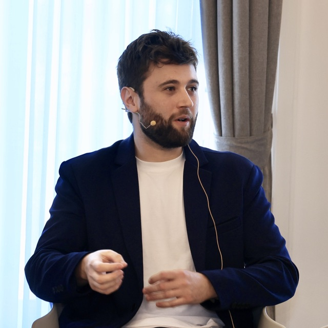

<section class="hero">
  

    
Senior LLM Researcher at <a href="https://multiversecomputing.com">Multiverse Computing</a>. I train, compress, and optimize large-scale foundation models for both language and vision.

    
PhD in Natural Language Processing from the <a href="https://www.ehu.eus/en/en-home">University of the Basque Country UPV/EHU</a>, developed at the <a href="http://www.ixa.eus/?language=en">IXA Group</a> and the <a href="http://www.hitz.eus/">HiTZ Basque Center for Language Technologies</a>.

    
I have strong, hands-on experience in performance optimization and HPC across academia and industry. At HiTZ I trained <a href="https://arxiv.org/abs/2506.07597">Latxa</a> on the <a href="https://leonardo-supercomputer.cineca.eu/hpc-system/">Leonardo Supercomputer</a> using up to 512 GPUs across 128 nodes. At <a href="https://www.krea.ai">Krea</a> I optimized fine-tuning pipelines for image and video diffusion models with distributed techniques such as FSDP2. At <a href="https://multiversecomputing.com">Multiverse Computing</a> I optimize inference and fine-tuning pipelines, achieving 3× faster logit precomputation and 5× faster KL-divergence training.

    
<a href="https://www.goexponential.org/directory/fellows/iker-garcia-ferrero">Exponential Fellow 2025</a>. In my free time I build <a href="https://veridika.ai">veridika.ai</a>, an AI agent framework for real-time fact-checking.

  

  <aside class="hero-aside">
    

      
      
Senior LLM Researcher

      
<a href="https://multiversecomputing.com">Multiverse Computing</a>

      
Donostia–San Sebastián · Spain

      
<a href="mailto:igarciaf896@gmail.com">igarciaf896@gmail.com</a>

      

        
        
        
        
        
        
      

    

  </aside>
</section>

## Featured Models

  

    
    

      <h3 class="card-title">Hypernova-60B</h3>
      
Multiverse Computing · 2026

      
A 60B-parameter compressed LLM optimized for agentic workflows and tool use.

      
📒 <a href="https://huggingface.co/MultiverseComputingCAI/Hypernova-60B-2602">Model</a>

    

  

  

    
    

      <h3 class="card-title">FLUX.1 Krea (Krea 1)</h3>
      
Krea · Black Forest Labs · 2025

      
A 22B diffusion image model with superior aesthetic control and image quality, fully compatible with FLUX.1-dev.

      
📖 <a href="https://www.krea.ai/blog/flux-krea-open-source-release">Blog</a> · 📒 <a href="https://huggingface.co/black-forest-labs/FLUX.1-Krea-dev">Model</a>

    

  

  

    
    

      <h3 class="card-title">GoLLIE</h3>
      
HiTZ · 2024

      
A 34B guideline-following LLM achieving state-of-the-art zero-shot Information Extraction.

      
📖 <a href="https://hitz-zentroa.github.io/GoLLIE/">Blog</a> · 📒 <a href="https://github.com/hitz-zentroa/GoLLIE/">Code</a>

    

  

  

    
    

      <h3 class="card-title">Latxa</h3>
      
HiTZ · 2025

      
A Basque instruction-tuned LLM with performance comparable to GPT-4o and Claude Sonnet.

      
📖 <a href="https://arxiv.org/abs/2506.07597">Paper</a> · 📒 <a href="https://huggingface.co/collections/HiTZ/latxa-instruct-682f356091452b0028380804">Models</a>

    

  

  

    
    

      <h3 class="card-title">Medical-mT5</h3>
      
HiTZ · 2024

      
The first open-source multilingual text-to-text LLM for the medical domain.

      
📖 <a href="https://aclanthology.org/2024.lrec-main.974/">Paper</a> · 📒 <a href="https://huggingface.co/HiTZ/Medical-mT5-xl">Model</a>

    

  

  

    
    

      <h3 class="card-title">Veridika.ai</h3>
      
Personal project · 2025

      
An AI agent framework for real-time fact-checking.

      
🔗 <a href="https://veridika.ai">Online Demo</a>

    

  

